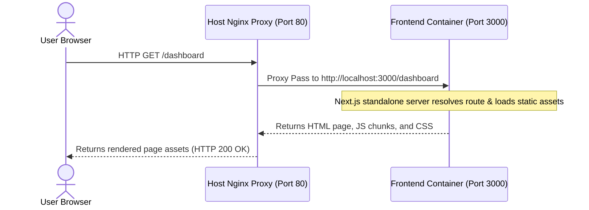

# Zenith Finance — AWS Production Deployment Report

This report outlines the step-by-step production deployment process of the Zenith Finance containerized application stack on AWS. Use this document as a reference for redeployments, scaling, or maintenance.

---

## 🏗️ Architecture Overview

The production system is deployed using a hybrid serverless/containerized approach to fit within the **AWS Free Tier** limits while maintaining high performance:

*   **Application Server (Compute)**: Single AWS EC2 instance (`t2.micro` or `t3.micro`) running Ubuntu 24.04 LTS.
*   **Database (Storage)**: Managed AWS RDS PostgreSQL instance (`db.t3.micro` or `db.t4g.micro`) in Private Access mode, bridged securely via VPC security groups.
*   **Cache & Queue Worker**: Upstash Redis (Serverless) for caching query results and managing BullMQ asynchronous jobs.
*   **Reverse Proxy / Web Server**: Nginx running on the EC2 host to route external port 80/443 traffic to the Next.js standalone container.
*   **Container Engine**: Docker & Docker Compose v2.

---

## 🔄 Request-Response Workflow Cycle

This section maps how a client's request travels through the hosted network and containerized environment.

### Scenario A: Requesting Static UI Assets (e.g. Navigating to `/dashboard`)



1. **Client Browser**: The user types the server's public IP address or DNS URL and hits Enter.
2. **AWS Network Boundary**: The traffic reaches the AWS VPC, passing through the EC2 Security Group (which permits ingress traffic on Port 80).
3. **Host Nginx Web Server**: Nginx intercepts the port 80 traffic. It matches the route and proxies the connection to `http://localhost:3000` (the Next.js standalone container).
4. **Next.js Frontend Container**: The internal standalone server resolves the requested route, fetches static bundles, compiles server-side elements, and returns the response payload.
5. **Nginx to Client**: Nginx intercepts the response from the container and serves it back to the client's browser.

### Scenario B: Mutating Data / API Requests (e.g. Submitting a transaction or signing up)

```mermaid
sequenceDiagram
    actor Client as User Browser
    participant Nginx as Host Nginx Proxy (Port 80)
    participant Frontend as Frontend Container (Port 3000)
    participant Backend as Backend Container (Port 5000)
    database RDS as AWS RDS PostgreSQL (Port 5432)
    database Redis as Upstash Redis Cache

    Client->>Nginx: HTTP POST /api/auth/register (payload)
    Nginx->>Frontend: Proxy Pass to http://localhost:3000/api/auth/register
    Note over Frontend: Intercepted by catch-all Route Handler (route.ts)<br/>Filters hop-by-hop headers
    Frontend->>Backend: Proxy Fetch to http://backend:5000/auth/register
    Note over Backend: Express checks schema (Zod)<br/>Runs validation checks
    Backend->>RDS: SQL checks/inserts (PostgreSQL)
    RDS-->>Backend: Returns saved user record
    Backend->>Redis: Set token data / Rate limit check
    Redis-->>Backend: Confirms OK
    Backend-->>Frontend: Returns signed JWT + user info
    Frontend-->>Nginx: Returns payload
    Nginx-->>Client: Returns payload (HTTP 201 Created)
```

1. **Client Browser**: The user submits a form. A POST request is dispatched to `/api/auth/register` (relative path).
2. **Nginx Routing**: Nginx receives the POST request on port 80 and forwards it to the Next.js container on port 3000.
3. **Next.js Catch-All Route Handler (`route.ts`)**:
   * Next.js catches the request at `app/api/[...path]/route.ts`.
   * The handler filters out proxy hop-by-hop headers (such as `Connection`, `Upgrade`) to avoid Node `fetch` Undici crashes.
   * It reads `BACKEND_API_URL` (configured as `http://backend:5000` in the environment) and proxies the request to the backend container over the internal Docker network.
4. **Express Backend Container**:
   * Receives the request on port 5000.
   * Validates request parameters using Zod schemas.
   * **Database Mutation**: Queries and writes the new user's hashed password and credentials into the **AWS RDS PostgreSQL** instance over port 5432.
   * **State Cache**: Writes active session tokens or invalidates relevant report caches in **Upstash Redis** (secure serverless instance).
   * Generates signed JWT access/refresh tokens.
   * Sends the successful response back.
5. **Response Return Loop**: The backend responds to the frontend container, which in turn returns it through Nginx to the user's browser, completing the transaction loop.

---

## 🛠️ Step-by-Step Server Configuration & Commands

### 1. SSH into the Server
Log into the EC2 instance using the AWS key pair:
```bash
ssh -i zenith-key.pem ubuntu@54.198.231.178
```

### 2. Configure OS Swap Space
To prevent the Next.js build from freezing or crashing the Free Tier instance's limited 1 GB RAM, we allocate a **2 GB Swap File**:
```bash
# Allocate 2GB block file
sudo fallocate -l 2G /swapfile

# Set restrictive permissions
sudo chmod 600 /swapfile

# Convert file into swap space
sudo mkswap /swapfile

# Enable the swap space immediately
sudo swapon /swapfile

# Persist swap configuration across reboots
echo '/swapfile none swap sw 0 0' | sudo tee -a /etc/fstab

# Verify memory allocations
free -h
```

### 3. Expand EBS Root Volume (Disk Resize)
Docker caches and Next.js builds easily fill up the default 8 GiB EBS volume. We expanded the EBS volume to **20 GiB** in the AWS console and extended the partition on the server:
```bash
# Verify drive names and mounts
lsblk

# Expand partition 1 on disk nvme0n1
sudo growpart /dev/nvme0n1 1

# Resize the ext4 filesystem to use the new space
sudo resize2fs /dev/nvme0n1p1

# Confirm the new disk size
df -h
```

### 4. Install Core System Dependencies
Install Git, Docker, Docker Compose, and Nginx on the host system:
```bash
# Update Ubuntu package catalog
sudo apt-get update -y && sudo apt-get upgrade -y

# Install certificates and curl
sudo apt-get install -y ca-certificates curl git

# Add Docker's official GPG key
sudo install -m 0755 -d /etc/apt/keyrings
sudo curl -fsSL https://download.docker.com/linux/ubuntu/gpg -o /etc/apt/keyrings/docker.asc
sudo chmod a+r /etc/apt/keyrings/docker.asc

# Add the repository to Apt sources
echo \
  "deb [arch=$(dpkg --print-architecture) signed-by=/etc/apt/keyrings/docker.asc] https://download.docker.com/linux/ubuntu \
  $(. /etc/os-release && echo "$VERSION_CODENAME") stable" | \
  sudo tee /etc/apt/sources.list.d/docker.list > /dev/null

# Install Docker engine and plugins
sudo apt-get update -y
sudo apt-get install -y docker-ce docker-ce-cli containerd.io docker-buildx-plugin docker-compose-plugin

# Install Nginx Web Server
sudo apt-get install -y nginx

# Add default ubuntu user to docker group (re-login required to apply)
sudo usermod -aG docker ubuntu
```

---

## 📦 Application Installation & Orchestration

### 1. Clone the Codebase
Clone the project repository to the user home directory:
```bash
cd /home/ubuntu
git clone https://github.com/anoopcodeup/Zenith-Finance.git
cd Zenith-Finance
```

### 2. Configure Production Secrets
Create the production environment file in the project root:
```bash
nano /home/ubuntu/Zenith-Finance/.env
```
Populate the file with the following variables:
```env
DATABASE_URL="postgresql://postgres:<PASSWORD>@zenith-finance-db.cctqkmqamg3i.us-east-1.rds.amazonaws.com:5432/postgres?schema=public"
REDIS_URL="rediss://default:<UPSTASH_TOKEN>@<UPSTASH_ENDPOINT>:<PORT>"
JWT_SECRET="<SECURE_TOKEN>"
JWT_ACCESS_SECRET="<SECURE_TOKEN>"
JWT_REFRESH_SECRET="<SECURE_TOKEN>"
JWT_EXPIRES_IN="1h"
INTERNAL_API_TOKEN="<SECURE_TOKEN>"
BACKEND_API_URL="http://backend:5000"
```

### 3. Orchestrate Docker Containers
Build and run the `backend` and `frontend` services. We use the `--no-deps` flag to bypass starting the local PostgreSQL and Redis containers, saving valuable server memory:
```bash
sudo docker compose up -d --no-deps --build backend frontend
```

---

## 🔀 Nginx Reverse Proxy Setup

Nginx acts as the edge gateway on the EC2 host. It listens on port 80/443 and proxies requests to the Next.js standalone container listening internally on port 3000.

### 1. Configuration File
Place the config block at `/etc/nginx/sites-available/default`:
```nginx
server {
    listen 80 default_server;
    listen [::]:80 default_server;

    server_name _;

    location / {
        proxy_pass http://localhost:3000;
        proxy_http_version 1.1;
        proxy_set_header Upgrade $http_upgrade;
        proxy_set_header Connection 'upgrade';
        proxy_set_header Host $host;
        proxy_cache_bypass $http_upgrade;
        
        # Forward client IP details
        proxy_set_header X-Real-IP $remote_addr;
        proxy_set_header X-Forwarded-For $proxy_add_x_forwarded_for;
        proxy_set_header X-Forwarded-Proto $scheme;
    }
}
```

### 2. Verify and Apply Configurations
```bash
# Validate Nginx configuration syntax
sudo nginx -t

# Apply config changes and enable startup
sudo systemctl restart nginx
sudo systemctl enable nginx
```

---

## 🐛 Notable Bugs & Troubleshooting

### 🚨 Bug 1: Disk Space Exhaustion During Build
*   **Symptoms**: Next.js typescript compiler or Prisma engine extract failed with: `write .../query_engine_bg.wasm: no space left on device`.
*   **Resolution**: 
    1. Resized root volume to 20 GB (described in Step 3 above).
    2. Purged Docker build cache and intermediate layers:
       ```bash
       sudo docker system prune -af --volumes
       ```

### 🚨 Bug 2: "Backend Connection Failed" on Auth Submissions
*   **Symptoms**: The frontend landing page resolved, but Sign Up/Sign In actions triggered a proxy 502 error. Frontend container logs showed:
    `Proxy error: TypeError: fetch failed` -> `[cause]: Error [InvalidArgumentError]: invalid connection header (code: 'UND_ERR_INVALID_ARG')`.
*   **Root Cause**: Under Nginx proxy configurations, a standard `Connection: upgrade` header is injected. When the Next.js catch-all api Route Handler proxied requests using Node’s `fetch` (*Undici*), it copied all incoming headers blindly. *Undici* throws errors when hop-by-hop connection headers (like `Connection`, `Keep-Alive`, `Upgrade`) are passed into `fetch` requests.
*   **Resolution**: Modified `frontend/app/api/[...path]/route.ts` to explicitly exclude hop-by-hop headers from proxy forward lists:
    ```typescript
    const hopByHop = ["host", "connection", "keep-alive", "upgrade", "transfer-encoding", "te"];
    request.headers.forEach((value, key) => {
      if (!hopByHop.includes(key.toLowerCase())) {
        headers.set(key, value);
      }
    });
    ```

---

## 📈 System Monitoring Commands

Use these commands on the EC2 host for monitoring:

*   **View Services Status**:
    ```bash
    sudo docker compose ps
    ```
*   **Tail Backend Logs (Database connections, server start)**:
    ```bash
    sudo docker compose logs -f backend
    ```
*   **Tail Frontend Logs (Nginx to Docker communication, route proxy outputs)**:
    ```bash
    sudo docker compose logs -f frontend
    ```
*   **Tail System Nginx Error Logs**:
    ```bash
    sudo tail -f /var/log/nginx/error.log
    ```
