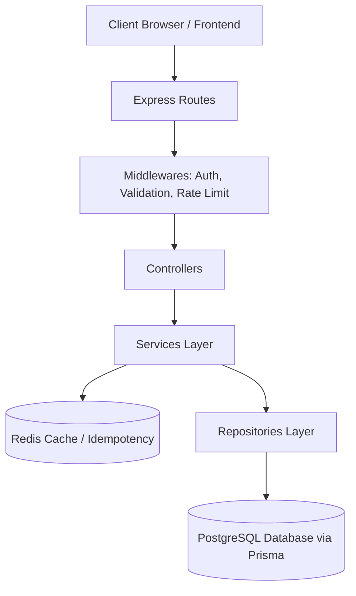

# System Architecture — Backend

Zenith Finance's backend is a production-grade Node.js service written in TypeScript using the **Express** framework. It adheres to a clean, layered architectural pattern that decouples HTTP transport logic from business services and database queries.

---

## 1. Directory Structure

```text
backend/src/
├── config/             # DB & Redis connection initializers
├── controllers/        # HTTP controllers (request/response orchestration)
├── jobs/               # Background task scheduler triggers
├── middlewares/        # Express request interceptors (auth, rate limits, validation)
├── queues/             # BullMQ queue definitions
├── repositories/       # Direct database access logic (Prisma queries)
├── routes/             # Express API endpoint registration
├── services/           # Core business logic layer (cache orchestration, transactions)
├── types/              # Domain and data type definitions
├── utils/              # Helper utilities (ciphers, cursor decoders, custom errors)
└── validators/         # Zod request validation schemas
```

---

## 2. Layered Architecture Pattern



### A. Routing & Transport Layer (`routes/` & `controllers/`)
* **Routes:** Endpoints are registered using Express `Router`. They enforce authentication and payload validation before reaching controllers.
* **Controllers:** Controllers extract parameters from `req` (like `userId` injected from JWT middleware, `params`, and validated `body`), invoke the relevant Service, and send the output back via HTTP status codes. They do *not* execute business logic or SQL queries directly.

### B. Business Services Layer (`services/`)
* **Scope:** The brain of the application. It orchestrates complex tasks such as transfers (which require writing multiple transaction records and updating balances atomically), triggers background jobs, invalidates caches, and runs audit loggers.
* **Transaction Isolation:** Coordinates Prisma database transactions (`prisma.$transaction`) to guarantee data integrity across multi-table updates.

### C. Database Access Repositories (`repositories/`)
* **Scope:** Encapsulates raw database queries. Every database access method is a repository helper.
* **Prisma Injection:** Repository methods accept a `PrismaTx` client instance. This allows them to run either on the global Prisma client or within an ongoing transaction context seamlessly.

---

## 3. Core Middlewares

| Middleware | File | Purpose |
| :--- | :--- | :--- |
| **Authentication** | `auth.middleware.ts` | Extracts the Bearer JWT token from headers, verifies it against the secret, and injects the authenticated `user` object into the request context. |
| **Validation** | `validate.middleware.ts` | Intercepts requests and parses input schemas (`body`, `query`, or `params`) against **Zod** validators. Returns 400 Bad Request if validation fails. |
| **Rate Limiter** | `rateLimit.middleware.ts` | Prevents API abuse and brute-force login requests using a Redis-backed sliding window algorithm. |
| **Error Handler** | `error.middleware.ts` | Global try/catch interceptor. Catches instances of custom `HttpError` classes, maps them to status codes, and sanitizes production errors to avoid leaking system stack traces. |

---

## 4. Key Implementation Patterns

### A. Cursor-Based Pagination
For high-performance transaction listing, the backend avoids slow `LIMIT/OFFSET` pagination (which scans all preceding rows) in favor of **Cursor-based pagination** using the `createdAt` timestamp and unique `id`:
1. The client receives an opaque base64-encoded cursor: `Buffer.from(createdAt + '|' + id).toString("base64")`.
2. On subsequent pages, the client sends this cursor back.
3. The repository decodes the cursor and queries:
   ```sql
   WHERE (createdAt < cursor.createdAt) 
      OR (createdAt == cursor.createdAt AND id < cursor.id)
   ORDER BY createdAt DESC, id DESC
   LIMIT PageSize
   ```

### B. Transaction Safety in Transfers
A fund transfer requires two entries: money going out of Account A and entering Account B. The backend implements this using Prisma's transactional isolation:
```typescript
await prisma.$transaction(async (tx) => {
  // 1. Verify balances and authorization
  // 2. Create EXPENSE transaction for Account A
  // 3. Create INCOME transaction for Account B
  // 4. Update balances of both accounts
});
```
If any of these operations fail, the entire transfer is rolled back, preventing orphaned records.

### C. Redis-Backed Atomic Rate Limiting
To protect endpoints from abuse, credential stuffing, and denial-of-service attempts, Zenith implements a custom **fixed-window rate limiter** powered by Redis and an atomic Lua script:

1. **Atomic Counter with Lua:**
   Normally, checking a rate limit requires checking a key, incrementing it, and setting an expiration. If done in separate commands, race conditions can occur between concurrent requests. Zenith solves this by executing a custom **Lua script** atomically on the Redis server:
   ```lua
   local current = redis.call('INCR', KEYS[1])
   if current == 1 then
       redis.call('PEXPIRE', KEYS[1], ARGV[1])
   end
   return current
   ```
   * `INCR` increments the counter for the client's key.
   * If the counter returns `1` (indicating a fresh window), `PEXPIRE` immediately applies a millisecond TTL (`ARGV[1]`).
   * This guarantees that counter increment and TTL setting occur in a single, non-blocking atomic transaction.

2. **Pre-configured Limits:**
   * **Public Limits (`rl:public`):** Applied to unauthenticated endpoints such as `/register` and `/login`. Restricts traffic to **10 requests per minute** per IP address to mitigate brute-force and spam signups.
   * **Authenticated Limits (`rl:auth`):** Applied to standard user endpoints (e.g. `/me`, `/logout`). Restricts traffic to **60 requests per minute** per user ID (falling back to IP address if user context is missing).
   * **Internal Limits (`rl:internal`):** Restricts high-throughput internal or admin-oriented operations to **100 requests per minute**.

3. **HTTP Response:**
   If a client exceeds their limit (`current > max`), the middleware interrupts the request, bypasses downstream route handlers, and throws a `429 Too Many Requests` HTTP error via the global exception handler.

