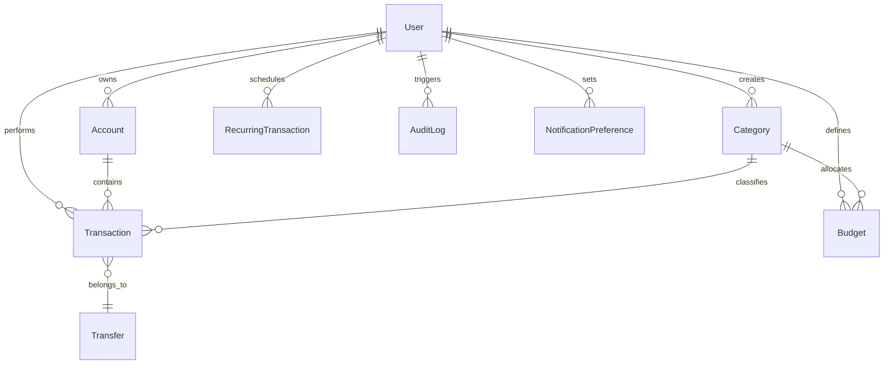

# System Architecture — Data Modeling & Database

Zenith Finance uses a **PostgreSQL** database managed via **Prisma ORM**. The data model enforces strict referential integrity, financial audit tracking, and soft-delete capabilities.

---

## 1. Database Entity Relationship Diagram (ERD)



---

## 2. Prisma Database Schema Models

### A. Core Models
* **`User`**
  - Stores email, password hashes, and timestamps.
  - Serves as the tenant isolation key. Every financial record must carry a `userId`.
* **`Account`**
  - Represents bank accounts or cash holdings.
  - Carries a `name` and a `type` enum (`SAVINGS`, `CREDIT`, `CASH`).
  - Supports soft-delete via `deletedAt` DateTime flags.
* **`Category`**
  - Represents transactional buckets (e.g. Food, Salary).
  - Can be global (`userId: null` seeded default categories) or user-specific custom categories (`userId: string`).
* **`Transaction`**
  - Represents a single money entry.
  - Carries `amount` (Decimal), `type` (`INCOME` | `EXPENSE`), and relationship fields `accountId`, `categoryId`, `description`, `createdAt`, and `deletedAt` for soft-deletes.
* **`Transfer`**
  - Acts as a grouping entity for matching transactions.
  - Has `fromAccountId`, `toAccountId`, and `amount` properties.
  - Linked back to transactions: A transfer records an **EXPENSE** transaction in the source account and an **INCOME** transaction in the destination account, both carrying the same `transferId`.

### B. Planning & Automation Models
* **`Budget`**
  - Captures category limits per month (formatted as `"YYYY-MM"`).
  - Keeps track of `amount` limits.
* **`RecurringTransaction`**
  - Serves as a transaction template schedule.
  - Contains frequency enums (`DAILY`, `WEEKLY`, `MONTHLY`, `YEARLY`), active statuses, and execution pointers (`startDate`, `endDate`, `nextRunAt`, `lastRunAt`).

---

## 3. Advanced Database Patterns

### A. Decimals for Financial Precision
Floating-point arithmetic (e.g., standard `Float` or `Double` types) is subject to binary rounding errors (e.g., `0.1 + 0.2 = 0.30000000000000004`), which is unacceptable in financial calculations.
* **Zenith Implementation:** All financial currency amounts (transactions, budgets, transfers) are modeled using **Prisma Decimal** (`Decimal(12,2)`) database fields. Decimal math is handled strictly on the CPU via library arithmetic to maintain exact precision.

### B. Soft-Delete Execution Pattern
Deleting historical ledger records breaks statistical reports and deletes audit history. To prevent data loss:
1. Deleting a transaction updates the `deletedAt` field to the current date/time instead of dropping the row.
2. In the repositories, queries that display active data filter by checking `deletedAt: null`.
3. In this application, we allow fetching soft-deleted items but display them with **muted visuals** (low opacity, strike-through, no delete icon, and showing a "Deleted" badge).
4. When a transaction is restored, `deletedAt` is set back to `null`, instantly reinstating it in the active calculations.

### C. Database Transaction Isolation & Lock Safety
When executing atomic updates (like executing a transfer or deleting a transaction which requires a cascade balance recalculation):
- **Why it matters:** Two parallel balance requests could conflict, resulting in a race condition.
- **Zenith Implementation:** Uses transactional connections (`prisma.$transaction`) with a sequential query approach to lock the parent `Account` row during mutations:
  ```typescript
  // Finds the account and locks it until the transaction commits or aborts
  const account = await tx.account.findUnique({
    where: { id: accountId },
  });
  ```
