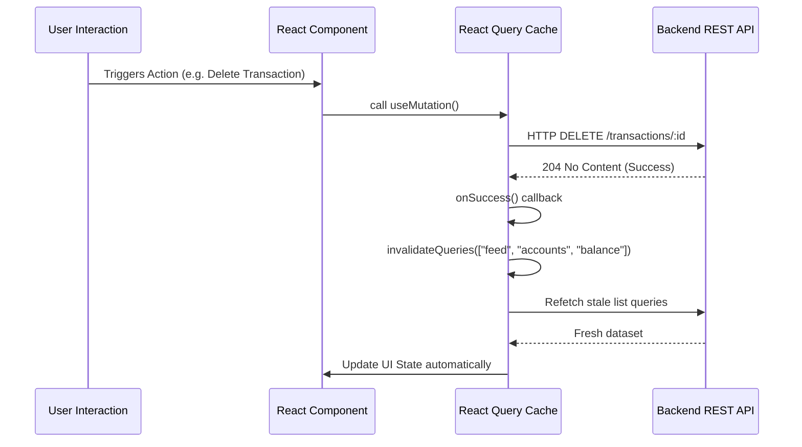

# System Architecture — Frontend

Zenith Finance's frontend is built with **Next.js 16 (App Router)** and TypeScript. It utilizes a client-side layout for authenticated routes, styled dynamically with vanilla Tailwind CSS, animated using Framer Motion, and managed statefully with Zustand and TanStack React Query.

---

## 1. Directory Structure

```text
frontend/
├── app/
│   ├── (auth)/             # Route group for Login/Registration flow
│   ├── (dashboard)/        # Route group for layouts requiring authentication
│   │   ├── accounts/       # Account index and details page ([id]/page.tsx)
│   │   ├── budgets/        # Monthly category budget management
│   │   ├── dashboard/      # Financial overview widgets & activity feed
│   │   ├── recurring/      # Scheduled transaction schedules
│   │   ├── reports/        # Spending category charts & summaries
│   │   └── transactions/   # Complete transaction feed with search/filter
│   ├── layout.tsx          # Global providers wrapper (React Query, Auth)
│   └── page.tsx            # Entrypoint routing redirect
├── components/             # Reusable UI widgets and layout modules (Sidebar, Topbar)
├── lib/
│   ├── api.ts              # Axios wrapper with automatic Bearer JWT injection
│   ├── queries/            # TanStack React Query custom hooks (mutations/queries)
│   └── utils.ts            # Formatting functions (Currency, Dates)
├── store/                  # Zustand global state stores (auth, UI toggles)
└── types/                  # Shared TypeScript models and API contracts
```

---

## 2. Page & Layout Strategy
The frontend leverages Next.js **Route Groups** (`(dashboard)` and `(auth)`) to isolate layouts and middleware requirements:
* **`(auth)`:** Login and registration paths. Rendered inside a simplified root layout.
* **`(dashboard)`:** Enforces a sidebar + sticky header view. The root of this group (`layout.tsx`) includes an authorization guard. On initial mount, it verifies if a valid JWT accessToken exists. If not, it redirects to `/login`.

---

## 3. Client State Management (Zustand)
Zustand is used to manage global, transient client state that does not require database persistence:
* **Auth Store (`auth.store.ts`):** Maintains the logged-in user profile details, loading states, and the JWT `accessToken`. Handles login, logout, and token refresh.
* **UI Store (`ui.store.ts`):** Manages responsive sidebar toggle states (`sidebarOpen`), and triggers global quick-add modals:
  * `quickAddOpen` (Add Transaction modal)
  * `transferOpen` (Transfer Funds modal)

---

## 4. Server State Caching & Synchronicity (TanStack React Query)
To fetch data from the REST API, manage network states (loading, error), and maintain local caches, the app uses **React Query**:



### Key Query Patterns:
* **Query Invalidation:** When mutations (like deleting/restoring a transaction or updating a budget) succeed, the query client invalidates specific query keys:
  * `invalidateQueries({ queryKey: ["feed"] })` (Updates recent activity lists)
  * `invalidateQueries({ queryKey: ["accounts"] })` (Updates account balances)
* **Infinite Queries (`useInfiniteQuery`):** Handles transaction scrolling page by page. It decodes the next pagination cursor returned by the API and passes it back on trigger (`fetchNextPage()`).

---

## 5. Axios API Interceptor (`lib/api.ts`)
To secure all database transactions, the Axios instance automatically injects the active token into headers:
```typescript
api.interceptors.request.use((config) => {
  const token = useAuthStore.getState().accessToken;
  if (token) {
    config.headers.Authorization = `Bearer ${token}`;
  }
  return config;
});
```

---

## 6. CSS & Transitions Guidelines
* **Harmonious Palette:** Zenith relies on deep slate/indigo theme (`bg-[#08080f]`, `bg-[#1c1c26]`, `border-[#2a2a38]`).
* **Hover Animation Conflicts:** To avoid lag, Tailwind CSS transitions (`transition-colors`) are isolated to styling properties (colors, borders, backgrounds) while **Framer Motion** manages scale and transform coordinates (`whileHover={{ scale: 1.02 }}`) independently.
