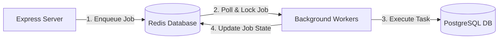

# System Architecture — Redis & Background Workers

Redis serves as the backend's high-speed, in-memory state engine. Decoupling long-running or resource-intensive tasks from the Express HTTP event loop is managed by **BullMQ** (powered by Redis) through a queue-and-worker architecture.

---

## 1. Architectural Layout



---

## 2. Redis Roles & Operations

### A. Caching Layer (Performance)
* **Target:** Heavy database aggregations, specifically the monthly finance reports (`reporting.service.ts`).
* **Storage Pattern:** Caches report outputs as JSON strings with key format: `cache:user:<userId>:month:<month>`.
* **Invalidation Strategy:** Cache-aside. When a user creates, edits, soft-deletes, or restores a transaction, the backend calculates the month of the transaction and invalidates the cached key immediately:
  ```typescript
  export const invalidateReportingCache = async (userId: string, date: Date) => {
    const month = date.toISOString().slice(0, 7); // e.g. "2026-06"
    const key = `cache:user:${userId}:month:${month}`;
    await redis.del(key);
  };
  ```

### B. Request Idempotency (Safety)
To prevent duplicate resource creation due to client-side button double-clicks or unstable connections:
* **How it works:** Mutating operations (like `createTransaction`) accept an optional header `x-idempotency-key`.
* **Mechanism:** The server uses Redis to store the state of the operation (`processing`, `resolved`) linked to the key:
  1. Checks if the key exists in Redis. If yes, wait (if processing) or return the cached JSON result immediately.
  2. If no, set the key to `processing` with a TTL (e.g. 5 minutes).
  3. Run the service handler, store the final outcome in the Redis key, and transition status to `resolved`.

### C. Message Broker for Background Task Queues
Redis stores queues (lists) and active worker locks. This allows distributing tasks to multiple worker processes securely.

### D. Rate Limiting State Store (Atomic Counters)
Redis keeps track of active request counts per client to enforce rate limits:
* **Key Schema:** `rl:<prefix>:<identifier>` (e.g. `rl:public:127.0.0.1` or `rl:auth:usr_1234`).
* **Storage Type:** Integer counter.
* **Auto-eviction:** The keys are configured with a millisecond-level TTL (Time To Live) matching the rate-limiting window (e.g., `60000ms` for a 1-minute window). Once the TTL expires, Redis automatically deletes the key, resetting the client's request budget.


---

## 3. Background Workers (BullMQ)

Zenith registers three asynchronous task queues, each monitored by dedicated background workers:

| Queue Name | Job Payload | Worker Trigger Logic | Action Performed |
| :--- | :--- | :--- | :--- |
| **`budgetAlert`** | `{ userId, month }` | Triggered whenever an `EXPENSE` transaction is logged, deleted, or restored. | Re-aggregates category spending. If it exceeds the user's budget limit, enqueues a `BUDGET_EXCEEDED` notification job. |
| **`monthlyAggregation`** | `{ userId, month }` | Enqueued by the cron scheduler on the 1st of every month. | Compiles monthly income, expense, and net savings totals and persists them in the `MonthlySummary` table. |
| **`notifications`** | `{ type, userId, payload }` | Triggered by other background workers. | Checks notification preferences. If enabled, runs a Redis-backed deduplication check (e.g. limit budget alerts to once every 24 hours) and prints the mock email log to the console. |

---

## 4. Cron Schedulers (`node-cron`)

A master cron scheduler triggers automated tasks at set frequencies:
1. **Daily Recurring Transactions (`0 0 * * *`):** Runs at midnight every day. Queries all active recurring transaction schedules (`nextRunAt <= now`), records standard transactions, advances the schedule pointer (`nextRunAt = nextRunAt + frequency`), and disables schedules that exceed their `endDate`.
2. **Monthly Summary Compiler (`5 0 1 * *`):** Runs at 12:05 AM on the 1st of every month. Queries all active users and schedules `monthlyAggregation` jobs to compile report data for the month that just ended.
